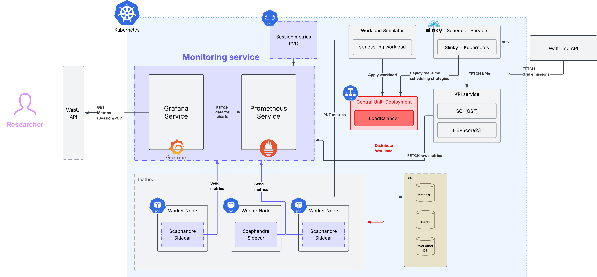

### 🔋 kesTACK · kubenergysched
kubenergysched is the sustainability-aware scheduler wrapper inside kesTACK. The goal is to integrate heterogeneous cloud infrastructures while optimising **sustainability**.

- **Fully-managed**: the user (developer/researcher) does not have to worry about the underlying computation and resource allocation.
- **Kubernetes-based**: Kubernetes is the *de facto* cluster framework used at the core of many cloud infrastructures.

### TODO development
- `scoreOnJobNode` and `SelectSiteAndNode` on `scheduler.go`: it's commented out, needs to be implemented.
- (Optional): clean unused files + Docker testbed configs.

### Testbed Architecture (WIP)


### Repository layout
```txt
kestack/
├─ KubEnergySched/              # Scheduler wrapper (Go module)
│  ├─ cmd/run_sim.go
│  ├─ cmd/gen_data.go           # CSV/JSON data generator (nodes/sites/workloads)
│  ├─ controller/               # K8s controller (Go module)
│  ├─ pkg/                      # Simulation core + shared structs
│  ├─ config/                   # CSV inputs (nodes/sites/workloads)
│  ├─ scripts/                  # Helper scripts
│  ├─ results/                  # Simulation outputs
│  └─ workloads/                # Generated workloads
├─ kes/
│  └─ policies/                 # Sustainability policies (former models)
├─ sim/
│  └─ powertrace/               # Trace tooling and features
├─ k8s/
│  └─ helm/                     # Helm charts and manifests
├─ kpis/
│  └─ forecast_service/         # Forecast / KPI microservice stub
├─ examples/
│  ├─ fabric_testbed/           # FABRIC automation scripts and notes
│  └─ jupyter/                  # Analysis notebooks
└─ docs/
   ├─ PLAN.md                   # Project refactor plan
   ├─ assets/                   # Architecture diagrams
   └─ thesis-overleaf/          # Thesis sources
```

### Generate CSV/JSON
- Recommended one‑liner (generates nodes.csv, workloads.csv, sites.csv, and sites.json):
  - `cd kubenergysched && go run ./cmd/gen_data.go --nodes-out=config/nodes.csv --workloads-out=config/workloads.csv --sites-csv-out=config/sites.csv --sites-json-out=config/sites.json --seed=42`

- Individual outputs, if needed:
  - Nodes CSV: `cd kubenergysched && go run ./cmd/gen_data.go --nodes-out=config/nodes.csv`
  - Workloads CSV: `cd kubenergysched && go run ./cmd/gen_data.go --workloads-out=config/workloads.csv --seed=42`
  - Sites CSV (simulator): `cd kubenergysched && go run ./cmd/gen_data.go --sites-csv-out=config/sites.csv`
  - Sites JSON (controller/helm): `cd kubenergysched && go run ./cmd/gen_data.go --sites-json-out=sites.json`

Notes
- Simulator expects `config/nodes.csv`, `config/workloads.csv`, `config/sites.csv`.
- K8s controller expects a `sites.json` ConfigMap (see `k8s/helm/charts/cluster_testbed/templates/site-config-configmap.yaml`).

### Run the Simulator (Kubernetes parity)
- Default one-liner (mirrors the Kubernetes replay inputs and writes into `results_latest` for the notebooks):
  - `cd kubenergysched && go run ./cmd/run_sim.go --nodes-csv=config/nodes.csv --wl-csv=config/workloads.csv --ci-weights=0.05 --batch-sizes=32 --outdir=results/results_$(date +%Y%m%d_%H%M%S) --trace-jsonl=auto`
- Adjust `--ci-weights` or `--batch-sizes` only if you want to explore additional configurations beyond the controller defaults.
- Run the heterogeneity-aware variants alongside the default schedulers (writes into a dated directory):
  - `cd kubenergysched && go run ./cmd/run_sim.go --nodes-csv=config/nodes.csv --wl-csv=config/workloads.csv --ci-weights=0.05 --batch-sizes=32 --het-modes=het-weighted-sum,het-epsilon-constraint,het-greedy-normalised --outdir=results/results_het_$(date +%Y%m%d_%H%M%S) --trace-jsonl=auto`


### End-to-End Controller Replay
Follow this quickstart to reset the cluster, (re)deploy the controller, replay the workload batch, and export the scheduling trace. Commands assume the repo root on a kind-based dev cluster; adapt node names or registry references as needed.

#### 1. Build and load controller images
```bash
docker build -t goncaloferreirauva/ciw-controller:latest -f kubenergysched/controller/Dockerfile .
docker build --target controller-debug -t goncaloferreirauva/ciw-controller:debug -f kubenergysched/controller/Dockerfile .
kind load docker-image goncaloferreirauva/ciw-controller:latest --name kes
kind load docker-image goncaloferreirauva/ciw-controller:debug --name kes
```

#### 2. Build and load the workload replayer
```bash
docker build -t goncaloferreirauva/workload-replayer:latest -f kubenergysched/workloads/Dockerfile kubenergysched/workloads
kind load docker-image goncaloferreirauva/workload-replayer:latest --name kes
```

#### 3. Reset namespace state and config
```bash
kubectl delete namespace workloads --ignore-not-found
kubectl create namespace workloads
kubectl -n workloads create configmap ciw-sites --from-file=sites.json=kubenergysched/config/sites.json
kubectl -n workloads create configmap workloads-csv --from-file=workloads.csv=kubenergysched/workloads/workloads.csv
```

### 3b. Delete jobs from previous runs (if we are starting on this point)
```bash
kubectl -n workloads delete job workloads-replayer --ignore-not-found
kubectl -n workloads get jobs -o name | grep '^job.batch/job-' | \
  xargs -r kubectl -n workloads delete
kubectl -n workloads delete pods -l ciw/eligible=true --ignore-not-found

# Restart the workloads
# kubectl -n workloads apply -f k8s/replay_workloads.yaml
# kubectl -n workloads logs job/workloads-replayer # to check what's going on inside
```

#### 4. Label nodes for the controller
The sample workloads expect site `B`. Ensure at least one node carries that label.
```bash
kubectl label node kes-control-plane site=B --overwrite
kubectl get nodes -L site
```

#### 5. Deploy / restart the controller
```bash
kubectl apply -f k8s/manifests/ciw-controller.yaml
kubectl -n workloads rollout status deploy/ciw-controller
# switch to the debug-friendly image so we can exec into the pod
kubectl -n workloads set image deploy/ciw-controller controller=goncaloferreirauva/ciw-controller:debug
kubectl -n workloads rollout status deploy/ciw-controller
```

#### 6. Start the workload replay
```bash
kubectl -n workloads apply -f k8s/replay_workloads.yaml
kubectl -n workloads get jobs,pods -l ciw/eligible=true
```

#### 7. Watch progress & export decisions
Gather the scheduling trace once jobs start flowing. The debug image has a shell, so `kubectl exec` can stream the log directly.
```bash
CTRL=$(kubectl -n workloads get pod -l app=ciw-controller -o jsonpath='{.items[0].metadata.name}')
kubectl -n workloads exec "$CTRL" -- cat /var/log/ciw/decisions.jsonl > k8s/results/decisions.jsonl
jq -r '{result_id,result_type,scheduler,job_id,node,site,e_norm,c_norm,cost,forecast_used,fallback} | [.result_id,.result_type,.scheduler,.job_id,.node,.site,.e_norm,.c_norm,.cost,.forecast_used,.fallback] | @csv' decisions.jsonl > k8s/results/decisions.csv
```

#### 8. Stop / cleanup between replays
```bash
kubectl -n workloads delete job workloads-replayer --ignore-not-found
kubectl -n workloads delete jobs -l ciw/eligible=true --ignore-not-found
kubectl -n workloads delete pods -l ciw/eligible=true --ignore-not-found
```

#### 9. Tear everything down
```bash
kubectl delete -f k8s/manifests/ciw-controller.yaml --ignore-not-found
kubectl delete namespace workloads --ignore-not-found
kubectl label node kes-control-plane site- --overwrite || true
```

Notes
- Switch the deployment back to the minimal image once finished exporting traces: `kubectl -n workloads set image deploy/ciw-controller controller=goncaloferreirauva/ciw-controller:latest`.
- If replayed Pods remain Pending, inspect resource usage versus node capacity: `kubectl -n workloads describe pod <pod>` and verify the node label matches `config/sites.json`.
- The default kind cluster created for development exposes a single node (`kes-control-plane`). Unless additional nodes are added and labelled (for example with `kind create cluster --config` that declares extra workers), all Kubernetes decisions will target site `B`.

